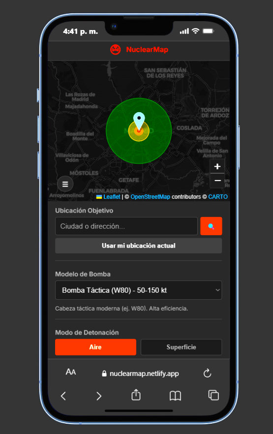
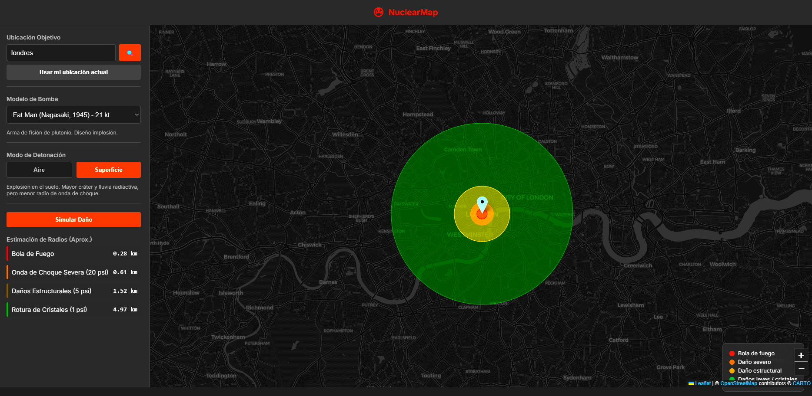

# ☢️ Simulador de Impacto Nuclear

En un mundo marcado por crecientes tensiones geopolíticas y la sombra constante de conflictos a gran escala, la comprensión de la magnitud devastadora de las armas nucleares es más relevante que nunca. **NuclearMap** nace como una herramienta de concientización social, diseñada para visualizar de manera técnica y cruda el alcance real de una detonación nuclear en cualquier punto del planeta.

Esta aplicación no es un juego, sino un simulador interactivo que busca educar sobre las consecuencias humanitarias y estructurales del uso de armamento atómico, fomentando una reflexión crítica sobre la paz global y la necesidad del desarme.

---

## 📸 Demostración Visual

A continuación se presentan capturas del funcionamiento de la herramienta, simulando diferentes escenarios de impacto:

*Explosión sobre zona metropolitana mostrando los radios de daño estructural y térmico.*

*Visualización a gran escala de una detonación de alto rendimiento.*

---

## 🚀 Funcionalidades Principales

NuclearMap permite configurar escenarios precisos para entender la dinámica de una explosión nuclear:

### 1. Geolocalización y Búsqueda de Objetivos
*   **Búsqueda Interactiva**: Localiza cualquier ciudad o dirección en el mundo mediante integración con OpenStreetMap (Nominatim).
*   **Ubicación Real**: Utiliza la geolocalización de tu navegador para posicionar el epicentro en tu ubicación actual.
*   **Mapa Interactivo**: Desplaza el marcador manualmente o haz clic en cualquier punto del mapa para definir el "Ground Zero".

### 2. Catálogo de Armamento Histórico y Moderno
El simulador incluye modelos basados en armas reales, desde las primeras bombas de fisión hasta las mega-ojivas actuales:
*   **Little Boy (15 kt)**: La bomba lanzada sobre Hiroshima.
*   **Fat Man (21 kt)**: La bomba lanzada sobre Nagasaki.
*   **W80 (50-150 kt)**: Cabeza táctica moderna de la flota estadounidense.
*   **Minuteman III (300 kt)**: Ojiva termonuclear ICBM promedio actual.
*   **Castle Bravo (15 Mt)**: La prueba termonuclear más potente de EE.UU.
*   **Tsar Bomba (50 Mt)**: El arma nuclear más grande jamás detonada (URSS).

### 3. Modos de Detonación
*   **Explosión Aérea (Air Burst)**: Maximiza el radio de la onda de choque y los daños estructurales al evitar que gran parte de la energía sea absorbida por el suelo.
*   **Explosión de Superficie (Surface Burst)**: Genera un cráter masivo y una lluvia radiactiva (fallout) mucho más intensa en las inmediaciones, aunque el radio de la onda de choque es menor.

---

## 🔬 Interpretación de los Radios de Daño

La simulación divide el impacto en cuatro zonas críticas, basadas en modelos físicos de sobrepresión (psi) y calor:

*   **🔴 Bola de Fuego (Radio Interno)**: Vaporización instantánea de toda la materia. Nada sobrevive.
*   **🟠 Onda de Choque Severa (20 psi)**: Destrucción total de edificios de hormigón reforzado. La tasa de mortalidad es del 100%.
*   **🟡 Daños Estructurales (5 psi)**: Colapso de la mayoría de los edificios residenciales. Incendios generalizados y heridos graves por escombros voladores.
*   **🟢 Rotura de Cristales / Daños Leves (1 psi)**: Radio exterior donde las ventanas estallan, causando heridas por vidrios. Es el límite visible del daño físico inmediato.

---

## 🛠️ Tecnologías Utilizadas

*   **Vite + React**: Para una interfaz rápida, reactiva y moderna.
*   **Leaflet**: El motor de mapas interactivos líder de código abierto.
*   **CartoDB Dark Matter**: Estética visual oscura para resaltar el impacto de los radios de daño.
*   **Nominatim API**: Para la búsqueda y geocodificación de ubicaciones.

---
> [!IMPORTANT]
> **Reflexión Final**: La única manera de ganar una guerra nuclear es asegurándose de que nunca ocurra. Este proyecto busca ser un grano de arena en la montaña de la concientización por un mundo libre de armas nucleares.

## 🤝 Créditos y Contribuciones

Este proyecto fue desarrollado y es mantenido por **Facundo Carrizo**.

*   **GitHub**: [@Facu14carrizo](https://github.com/Facu14carrizo)
*   **LinkedIn**: [Facundo Carrizo](https://www.linkedin.com/in/facu14carrizo/)

## 📄 Licencia

Este proyecto está bajo la Licencia MIT. Siéntete libre de usarlo, modificarlo y compartirlo con el fin de seguir concientizando sobre el impacto global de las armas nucleares.

